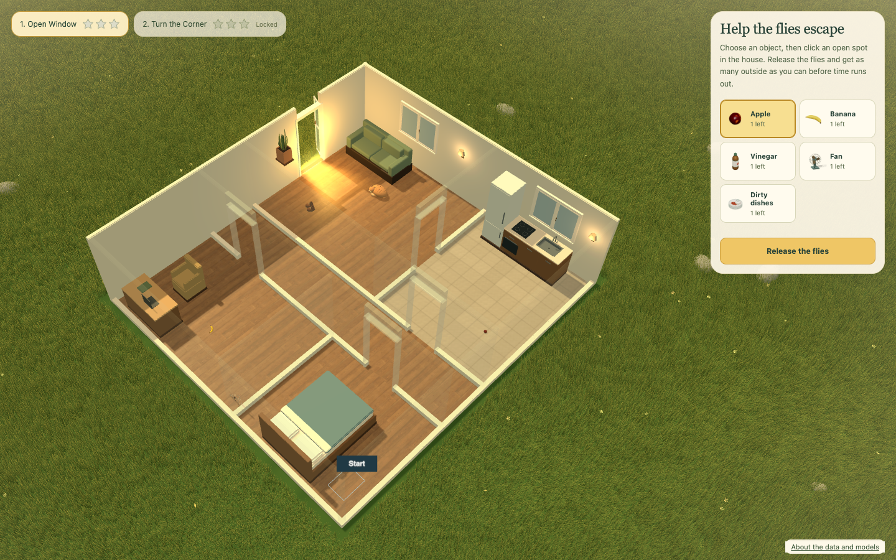

# Help the Fly Escape

**A little house. A swarm of flies. A real connectome behind every wrong turn.**

[Play in your browser](https://fly-escape.vercel.app)

Arrange household objects, release the flies, and see how many find their way outside before time runs out. You shape their surroundings; their simulated neurons drive their movement. Watch the swarm, follow one curious fly, or peek inside its brain as it explores.



A fully 3D browser game that runs locally, with Rust compiled to WebAssembly for the simulation and TypeScript for the world and interface. No account or application backend required.

## Play, observe, try again

Place objects around the house, then **Release the flies**. Earn stars for the flies that escape and change your arrangement for the next attempt. The fun is discovering what they respond to—and whether that response actually helps them leave.

- **Explore two furnished houses.** Work around the surroundings already there, with a limited selection of objects of your own.
- **Follow an individual.** Click a fly or its roster card to follow it and inspect its simulated neural activity. The brain view and traces come with plain-language explanations.
- **Watch at your own pace.** Choose real time or a fast replay that fits the full round into about a minute. Pause and rewind to inspect a moment.

Scroll to zoom, move to the screen edge or drag to pan, and hold the right mouse button while dragging to rotate. The rotation-reset button restores the original angle. Progress and arrangements are saved in your browser.

## Biology → simulation → observed behavior → game design

We build the game around the behavior we discover. We do not start with a desired strategy and force the neurons to make it work.

A **connectome** is a map of neurons and their connections. This game uses a selected part of the MaleCNS fly connectome, giving each fly its own simulated electrical activity and randomness. The connections come from real data; the neuron equations, sensory inputs and movement rules are models. This is an experiment with biological structure, not a validated digital replica of a living fly.

That uncertainty is part of the game. An object need not affect every fly in the same way to make an interesting decision. The aim is to influence the swarm while discovering how it responds. Neural explanations describe the model without revealing a recipe for each object.

## Run locally

Install Bun, Rust, and wasm-pack. From a checkout of this repository:

```sh
rustup target add wasm32-unknown-unknown
bun install
bun run build
bun run dev
```

Open the URL printed by the development server. The prepared connectome graph and its provenance manifest are committed with the game, so ordinary builds need neither Python nor a source-data download. Python is only needed to regenerate the graph or run the offline reference checks; see [graph preparation](scripts/connectome/README.md).

To serve the finished build, or work on the simulation and artwork, see the [development guide](docs/development.md).

## Current limits

The two-level game loop is playable, but difficulty is still experimental. Object placement changes observed outcomes; consistent repulsion and the frequency of higher star scores are not established. Feeding and life extension are deferred.

The simulation buffers before playback, and that initial wait can exceed a minute. Larger swarms and broader performance tuning remain future work. See the [release checks](specs/done/help-the-fly-escape/assets/evidence/release-final/README.md) for measured results and browser coverage.

## Data and credits

The game uses a selected subgraph of **Janelia FlyEM’s MaleCNS v1.0**. See the [graph preparation guide](scripts/connectome/README.md#data-attribution) for source credits, the dataset license and how the data is transformed. The game’s About page also links to its bundled provenance manifest.

For contributors, the [development guide](docs/development.md) explains the code and asset boundaries. The [design rationale](specs/done/help-the-fly-escape/README.md) preserves the reasoning, research and modeling decisions behind the game.
