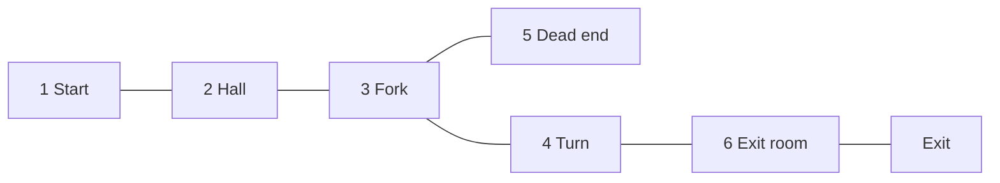

# Turn the Corner — prepared Level 2 greybox

This is an uncalibrated six-room candidate, not accepted campaign content. No neural attempt or seed batch ran. The candidate remains here rather than in the app's level registry. Its parent frozen Level 1 hash is recorded in provenance.json; body configuration, tuning, twenty spawn poses and duration are inherited unchanged.

The extra decision is a required turn at a real fork. Continuing straight enters a one-door dead end; the exit requires turning into the upper route. An additional existing fan supports that bend. Reference and poor candidates use the same positions and inventory; poor points the fork fan into the dead end and reverses the two upper-route fans. This is a hypothesis about useful orientation, not a measured difficulty claim.

The diagram is explanatory; candidate.json Geometry is the sole layout owner. Native tests discover the expected adjacency through actual body sweeps, verify the route in both directions and the closed boundary from dead-end room 5 to exit room 6, and validate both complete tool arrangements. FieldSet sampling confirms the reference junction fan supplies northward wind beyond the actual opening. The 1.1-wide turn opening clears the inherited body and fan placement footprint; its wall masking is retained. Future neural calibration must test whether flies negotiate it reliably.

The read-only greybox.html/greybox.ts entry imports the shared WorldView and authored asset loaders, consumes candidate Geometry/placements, and places one static diagnostic fly at the fork. It has no Worker, second layout or movement controller. catalog.json is an optional file export of Rust tool_catalog from the native test, used only by this evidence harness. The browser captures show Overview, the reference junction, and the same junction with poor fan directions. browser.json records zero browser errors after a harmless initial favicon 404 was fixed in the harness. Native and browser evidence do not establish neural outcomes.

Reproduce with the repository Vite server rooted at the checkout on port 5278 and open this HTML path. capture.mjs drives the visible controls and saves the three full frames. Run `cargo test -p sim --test level2_prepared -- --nocapture` for geometry/field/placement checks; set `GREYBOX_CATALOG_OUTPUT` to regenerate the catalog snapshot from its Rust owner. The standard app and house workbench fixture are untouched.

## Review and choices

The required bend rather than another straight room follows the delegated new-placement-decision scope. Retaining body/tuning/time isolates future content effects; adding one existing fan uses the validated tool contract. No cue threshold, field startup, graph, collider or visual material change was made. These choices are reversible and have high-confidence scope support.

Source review and independent visual findings are recorded below when complete. Level 1 acceptance, subsequent neural feasibility/full validation, actual campaign hookup and human route review remain pending. Do not promote this candidate based on geometry or screenshots alone.

Independent visual review inspected all three full frames then three tight crops, with prior house/tool review context disclosed and no source inspection. It found no blocking geometry/render defect: the connected footprint, openings and exit read clearly, joins are continuous, and selected body/head/legs/ring remain clear at the fork. Fan reversal is obvious. Medium-confidence limitation: short divider stubs and absent room labels mean the exact six-room numbering/dead-end mapping relies on the caption; the broad turn versus straight continuation reads visually. Tight junction crops exclude the terminal dead end. This is acceptable for prepared geometry inspection, not final human puzzle-comprehension acceptance.

Root independently reviewed the native test and approved prepared scope: actual sweep, field and placement checks are coherent. The scan bounds are explicitly fixture-specific. Catalog export is opt-in and file-based so routine test logs do not duplicate the tool registry.
