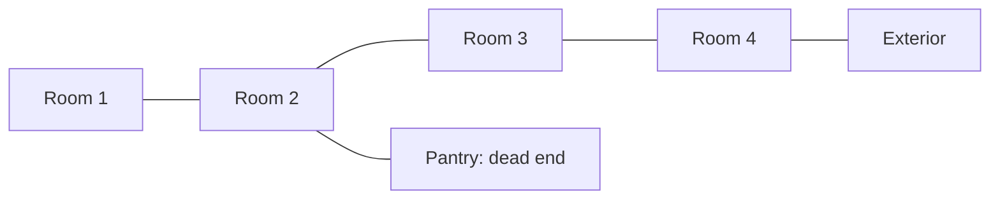

# House review topology

The neutral house fixture is stored once in [five-rooms.json](../../../../../assets/house/five-rooms.json), using the core's `Geometry` schema. Four rooms form a route to the exterior opening; a fifth room is a one-door pantry branching from the second. This is a geometry review fixture, not a balanced campaign level.

The native consumer test validates the payload through the field owner, samples neighboring room cells through the actual body sweep, and confirms exactly four interior connections. It also checks pantry return, its closed far wall, blockage beside its door, and passage through the exterior opening. One test passes. There is no separately authored doorway/collision graph. The upcoming renderer consumes this same payload with the modular kit; room art and collision/render agreement remain open until that integration is checked in the browser.

This pass adds no runtime code, simulation source change, dependency or WASM rebuild. The dimensions are delegated review geometry and do not establish puzzle difficulty. Shape/diff/docs review keeps the fixture and its consumer test together; the active slice links this evidence. Final house acceptance still requires the remaining slice-10 gates.
