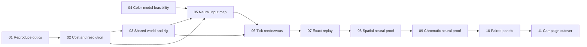

# Retinal vision

Give each fly two low-resolution views of the room, feed the sampled images into its existing neural circuit, and show recorded left and right color eye previews in each fly’s detail view in the right column, above its existing brain-and-traces block. First prove one fly; then enable the same path for the sixteen-fly campaign.

This is a plan, not an implemented or verified feature. Spatial and color input, plus downstream responses attributable to each, are the success criteria. Useful visual navigation remains an experiment, not a promised outcome.

## Next Agent Prompt

**Status: implementation started; updated 2026-09-09.** Reference optics and the independent color-source audit are the first work. No implementation slice has passed yet. You should start with [01 — reproduce the reference optics](slices/01-reference.md), then execute the graph below. Read [contracts](contracts.md), [research](research.md), and [decisions](decisions.md) first. Update this prompt, the checklist, and the owning slice's verdict before ending each pass.

The code inspected for this plan is `88813fe5c552e42269ba63858fe0e0057fbfcb43`, the integrated `origin/main`. Implementation fast-forwarded local `main` from `2b500c7` to that integrated revision using Git’s no-overwrite-ignore protection. Unrelated local files remain outside the feature. Inspect current Git state before each pass. The user explicitly requested removal of all `codex/` branches: do not recreate one for this work. A detached worktree is available if isolation is necessary.

The first unresolved technical gate is whether the low-resolution renderer can meet the measured cost and readability requirements. Do not infer that small textures make capture cheap. A second gate is whether the retained graph supports a declared color-channel mapping in addition to spatial brightness responses. No missing art or credentials block slice 01: use asymmetric generated optical fixtures; the existing authored assets are the production source.

- [ ] [01 Reference optics](slices/01-reference.md): reproduce, pin and measure the reference.
- [ ] [02 Acquisition feasibility](slices/02-feasibility.md): settle capture cost, quality profile and archive arithmetic before integration.
- [ ] [03 Shared world and eye rig](slices/03-world-and-eyes.md): sample the authoritative world with full pre-neural orientation.
- [ ] [04 Color-model feasibility](slices/04-color-model.md): audit retained cells and freeze a defensible rendered-color adapter.
- [ ] [05 Retinal input map](slices/05-input-map.md): export bounded spatial and channel assignments.
- [ ] [06 Tick rendezvous](slices/06-tick.md): consume exactly one matching eye batch before each neural tick.
- [ ] [07 Exact replay](slices/07-records.md): retain consumed bytes and reject old records without crashing.
- [ ] [08 Spatial neural proof](slices/08-neural-proof.md): verify the complete one-fly spatial/brightness chain.
- [ ] [09 Chromatic neural proof](slices/09-color-proof.md): separate color responses from brightness and total dose.
- [ ] [10 Paired eye panels](slices/10-panels.md): show each fly’s paired color previews in its right-column detail view during playback, pause and rewind.
- [ ] [11 Campaign cutover](slices/11-campaign.md): verify sixteen flies, remove the old visual input, and close the feature.

If a technical gate fails, record the negative result and reslice the affected work; do not weaken the gate, invent steering, silently lower quality, or mark the entire feature complete. Human visual review is non-blocking; failed correctness and resource gates remain real failures.

## Roadmap and review map

[Open the visual roadmap](visualizations/roadmap.html). The first useful browser checkpoint is the `/retina` workbench in slice 02: turn a fixed fly pose and inspect low-resolution L/R samples, before claiming that a brain consumes them.

| Review | The question the artifact answers |
| --- | --- |
| Reference and quality pairs | Do the eyes show the correct directions and enough room structure at low resolution? |
| Capture benchmark | Is capture practical with actual assets and concurrent game rendering? |
| Registration atlas | Which spatial/color samples reach which retained neurons, and which are unrepresented? |
| Tick and archive probes | Are these exactly the inputs consumed by that fly at that tick? |
| Neural experiment | Do spatial/intensity/color changes reach downstream cells, with silencing controls? |
| Paused and rewound campaign | Do the panels remain truthful, readable and responsive for a full round? |

## Scope and user decisions

The user asked for real paired eye inputs inspired by Daniel Tan's demo, explicitly welcomed low resolution for performance, and requested a spec before implementation. The initial proposal was one fly, exact sensory panels and neural responses, followed by sixteen flies. The planning default remains that useful visual navigation is not required; no user instruction expands this to learned steering or biological retinal fidelity.

The user rejected the proposed grayscale shortcut: **the final eyes must retain color**, and color must be available to affect the circuit. This supersedes the early grayscale drafts. Low spatial resolution is allowed; collapsing the final neural signal to brightness is not. Demonstrate matched-brightness chromatic responses separately from intensity responses; do not promise a large or specific motor preference.

The user explicitly chose **no old-replay compatibility**, then added: **“just dont crash if you see old replay.”** Old versions must therefore produce a handled unsupported-record result and a recoverable message. No migration, compatibility decoder, or uncaught exception. Saved campaign progress and object arrangements survive.

Preserve sixteen campaign flies, authored room geometry, timers, 2/5/10 star thresholds, odor/taste pathways, body dynamics, movement readouts and About. The visual sensory signal necessarily changes; do not promise identical trajectories, difficulty or escape counts. Do not add target labels, exit bearings, centroid steering, artificial photoreceptors, training, MuJoCo runtime dependencies, a WebGPU rewrite, or a new persistence/import UI.

## Proposed end state

The first capture candidate is **32×32 RGB renders per eye → 61 RGB8 compound samples per eye → 10 Hz**, locked to the existing 0.1-second simulation tick. Capture and display resolution are separate: panels enlarge the recorded mosaic without inventing detail. These values are a testable initial profile, not measured quality or speed claims. Slice 02 has the only bounded pre-integration quality-selection authority.

Use a dedicated sensory scene built by the same world-construction owner as the game, in a worker-owned WebGL2 renderer if the feasibility gate succeeds. Rust requests a complete pre-neural snapshot; capture returns a bounded batch; Rust consumes it, steps brains/bodies, and records the same bytes. The selected-eye UI reads the archive. Native tests consume exported eye batches; they do not pretend a field sampler reproduces GPU optics.

## Single-owner invariants

- Resolved setup and existing authoring own geometry, placements and light definitions. Shared world construction owns mesh assembly. Sensory and presentation instances are separate because their times and visibility rules differ; they are not separately authored worlds.
- An immutable eye profile owns projection, rig, sample layout, exposure and quantization. The offline exporter owns retinal spatial/channel weights and provenance.
- `Attempt` owns simulation time, pre-neural body snapshots and tick advancement. Capture supplies observations and never advances bodies or invents motor commands.
- Native record layout owns bytes and offsets. `FrameArchive` owns retained history. Eye panels only display recorded samples.
- The end state has one visual-current path. The old eight-direction implementation may remain only as the named baseline control during slices 02–10; slice 11 removes it and its stale consumers before the feature ships. No permanent fallback or compatibility layer survives.

## Standing verification gates

Every slice inherits its linked scenarios and [resource contracts](contracts.md#resource-budgets). Run the repository's [code-review skill](../../.agents/skills/code-review/SKILL.md) before accepting each implementation slice. Run [refactor-clean](../../.agents/skills/refactor-clean/SKILL.md) at integration boundaries; preserve the owners above rather than accumulating adapters.

For **every visual artifact**, inspect it locally, use [compare-screenshots](../../.agents/skills/compare-screenshots/SKILL.md) when a reference or previous look exists, and run an **unprimed [screenshot-critique](../../.agents/skills/screenshot-critique/SKILL.md) as the last visual check before acceptance**. Each slice states its crop and variable. A single-shot critique cannot replace comparative telemetry. Store captures, measured differences and verdicts under this feature's `assets/`, not only in mutable product snapshots or `/tmp`.

At a human checkpoint, open the shots using [preview-shots](../../.agents/skills/preview-shots/SKILL.md), explain the one decision being reviewed, and allow about five minutes while continuing independent work. If the user stays silent, decide from the evidence, record why, close the opened shots through the skill, and continue. Silence does not cure a failed gate.

When all slices ship, use [close-spec](../../.agents/skills/close-spec/SKILL.md) to archive this plan and preserve the rationale, negative results and measured limits.
